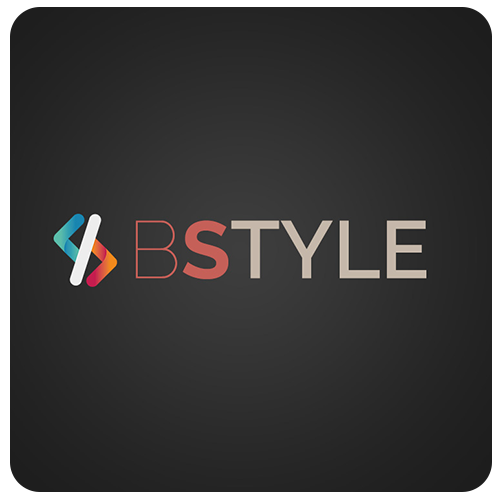

# Lu Neira Centro de Estética

<h3>
Lu neira es un centro de estética ubicado en la localidad de Santa Fe Capital, Argentina, donde se ofrecen diversios servicios realacionados a la estética corporal, entre ellos Manicuría, Belleza en Pies, Tratamientos Corporales y Faciales, Masajes, y muchos mas.

En este proyecto realizado con React JS, lo que se realizo es el ecommerce de una linea de producots Idraet que se utilizan profesionalmente y se venden para apoyo domiciliario dentro del centro.
</h3>

## Tecnologías y librerías utilizadas Utilizadas

 

  

  

    

- React JS - Vite.
- SASS
- React Router Dom
- React Toastify
- Firebase
- Swetalert2
- YUP
- GIT / GITHUB
- Netlify
- Visual Studio Code

## Dependencias

`react` `firebase` `react-dom` `react-icons` `react-router-dom` `react-spinners` `react-tostify` `sass` `sweetalert2` `yup`

## Estado del proyecto

El proyecto se encuentra en desarrollo, el ecommerce fe el inicio, pero aún falta toda la parte de servicios, venta de cursos educativos, agenda online que se desarrollará en los proximos meses

## Contacto

Mi nombre es Bernardo Borges, Desarrollador Web y Diseñador UX/UI, creador de BSTYLE.
A continuación les comparto el link a mi portafolio como así también a mi perfil de LinkedIn.

 

  
 
    
  

  
 
    
  

